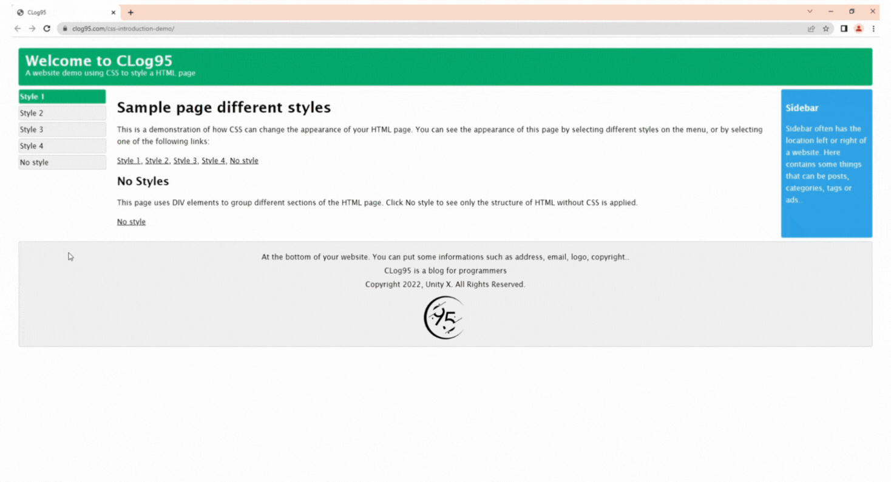
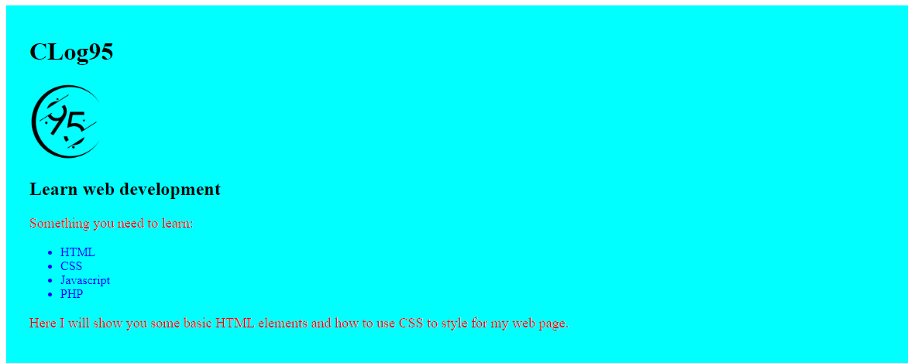

## What is CSS?

CSS stands for Cascading Style Sheets. Like HTML, CSS is not a programming language, it's not a markup language either. CSS is a style sheet language, it's used to style your web pages.

- CSS describes how HTML elements are to be displayed on screen, paper, or in other media.
- CSS is very helpful, it can control the layout of multiple web pages all at once.
- External stylesheets are stored in CSS files.

## CSS Demo - Using CSS to style a HTML page

HTML was only created to describe the content of a web page. So you need to use CSS to change the appearance of your HTML page.

**Note:** if you don't know what HTML is, I suggest you pause here to read [the HTML Introduction](https://clog95.com/posts/html-introduction/).

Here I will show you a HTML page displayed with four different styles. Click on the Style 1, Style 2, Style 3, Style 4 to see different styles and click on the No style to see only the HTML page without CSS.



To see the full web page above [click here](https://clog95.com/css-introduction-demo/).

## Why Use CSS?

CSS is used to define styles for your web pages, including design, layout and variations in display for different devices and screen sizes.

 With CSS you can decorate your website with colors, fonts, images.. to make it more interesting.

 ## Consider and Anatomy a Simple Instance

 I will show you how to create a simple web page with cyan background, a logo image, 2 heading, 2 paragraphs and an unordered list. The sample page as below:

 

 Now, you can [download the code and image sample here](https://drive.google.com/drive/folders/1I9VgXOy-N2HqXy3vD51tT_TgS1aDvyLY?usp=sharing) to follow and compare to this tutorial.

 #### 1. Create an index.html file

 On your computer create a folder and name it **my-site** then create an **index.html** file inside **my-site** folder.

 Open **index.html** file and then copy and paste the following codes into it.

 ```html
 <!DOCTYPE html>
<html lang="en">
<head>
	<meta charset="UTF-8">
	<meta name="viewport" content="width=device-width, initial-scale=1.0">
	<title>Document</title>
</head>
<body>

</body>
</html>
```

- The code above is a standard HTML5 document for every web page. If you don't know what HTML is, I suggest you pause here to read [the HTML Introduction](https://clog95.com/posts/html-introduction/).

- You don't need to worry about what it means, just use it and we will learn it later in this series.

#### 2. Insert a `<div>` element with a class name is container to wrap your web contents

Create a  `<div>`  element with a class named **container** and then position it between `<body>` and `</body>` tags. Look like bellow:

```html
<!DOCTYPE html>
<html lang="en">
<head>
	<meta charset="UTF-8">
	<meta name="viewport" content="width=device-width, initial-scale=1.0">
	<title>Document</title>
</head>
<body>
	
	<div class="container">


	</div>

</body>
</html>
```

#### 3. Add a heading `<h1>` element defines the main heading

Insert `<h1>` element with its content is **CLog95** into between `<div class="container">` and `</div>`. Look like bellow:

```html
<!DOCTYPE html>
<html lang="en">
<head>
	<meta charset="UTF-8">
	<meta name="viewport" content="width=device-width, initial-scale=1.0">
	<title>Document</title>
</head>
<body>
	
	<div class="container">
		
		<h1>CLog95</h1>

	</div>

</body>
</html>
```

#### 4. Add an `` element to get an image
Download [the image logo here](https://drive.google.com/file/d/1IMvdKo-FqEMBc9KjYi1QDgQ5Wv1Tk-gH/view?usp=sharing) and put it inside **my-site** folder, the same folder with **index.html** file.
Insert `` element with an image path is **"clog95-logo.png"** for `src` attribute inside container class and below `<h1>` element. Look like bellow:

```html
<!DOCTYPE html>
<html lang="en">
<head>
	<meta charset="UTF-8">
	<meta name="viewport" content="width=device-width, initial-scale=1.0">
	<title>Document</title>
</head>
<body>
	
	<div class="container">
		
		<h1>CLog95</h1>

		

	</div>

</body>
</html>
```

#### 5. Add the rest contents for the web page

I will insert a heading `<h2>` element, two `<p>` elements, an unordered list `<ul>` with its contents. Look like bellow:

```html
<!DOCTYPE html>
<html lang="en">
<head>
	<meta charset="UTF-8">
	<meta name="viewport" content="width=device-width, initial-scale=1.0">
	<title>Document</title>
</head>
<body>
	
	<div class="container">
		
		<h1>CLog95</h1>

		

		<h2>Learn web development</h2>

		<p>Something you need to learn:</p>

		<ul>
			<li>HTML</li>
			<li>CSS</li>
			<li>Javascript</li>
			<li>PHP</li>
		</ul>

		<p>Here I will show you some basic HTML elements and how to use CSS to style for my web page.</p>

	</div>

</body>
</html>
```

#### 6. Write CSS to style for the web page.

Here I will write CSS into `index.html` file, so I must insert `<style>` `</style>` tags between `<head>` and `</head>` then write some CSS codes between `<style>` and `</style>`.

```html
<!DOCTYPE html>
<html lang="en">
<head>
	<meta charset="UTF-8">
	<meta name="viewport" content="width=device-width, initial-scale=1.0">
	<title>Document</title>

	<style>
		/* Writing CSS codes here */
	</style>

</head>
<body>

</body>
</html>
```

**First:** setting the background color is cyan and padding the content in for **container** class

```html
<style>
	.container {
		background-color: cyan;
   		padding: 20px 30px 30px 30px;
	}
</style>
```

**Next:** setting the color to red and font size for the contents of the `p` elements

```html
<style>
	p {
		color: red;
		font-size: 18px;
	}
</style>
```

**Next:** setting the color to blue for the contents of the unordered list `ul`
```html
<style>
	ul {
		color: blue;
	}
</style>
```

**Next:** setting the width of the image logo is 100px
```html
<style>
	img {
		width: 100px;
	}
</style>
```

**Final:** All the CSS code look like this
```html
<style>

	/* CSS for container class: cyan background and padding the content in */
	.container {
		background-color: cyan;
   		padding: 20px 30px 30px 30px;
	}

	/* CSS for p elements: paragraphs is red and font size is 18px */
	p {
		color: red;
		font-size: 18px;
	}

	/* CSS for ul elements: color letters is blue */
	ul {
		color: blue;
	}

	/* CSS for img elements: setting the image width is 100px */
	img {
		width: 100px;
	}
		
</style>
```

**Note:** the texts between /* and */ are only a way to write comments to note for you what CSS does so that you can remember what you do when you see it again a long time later.

#### 7. Combines all the codes into index.html file

I will put all CSS codes written between `<style>` `</style>` tags into between `<head>` and `</head>`. Finally all the code inside `index.html` file is look like bellow:

```html
<!DOCTYPE html>
<html lang="en">
<head>
	<meta charset="UTF-8">
	<meta name="viewport" content="width=device-width, initial-scale=1.0">
	<title>Document</title>

	<style>

		/* CSS for container class: cyan background and padding the content in */
		.container {
			background-color: cyan;
   			padding: 20px 30px 30px 30px;
		}

		/* CSS for p elements: paragraphs is red and font size is 18px */
		p {
			color: red;
			font-size: 18px;
		}

		/* CSS for ul elements: color letters is blue */
		ul {
			color: blue;
		}

		/* CSS for img elements: setting the image width is 100px */
		img {
			width: 100px;
		}
		
	</style>
</head>
<body>
	
	<div class="container">
		
		<h1>CLog95</h1>

		

		<h2>Learn web development</h2>

		<p>Something you need to learn:</p>

		<ul>
			<li>HTML</li>
			<li>CSS</li>
			<li>Javascript</li>
			<li>PHP</li>
		</ul>

		<p>Here I will show you some basic HTML elements and how to use CSS to style for my web page.</p>

	</div>

</body>
</html>
```

You can download [**my-site** folder here](https://drive.google.com/drive/folders/1I9VgXOy-N2HqXy3vD51tT_TgS1aDvyLY?usp=sharing) that includes the code and image in and compare with your result.