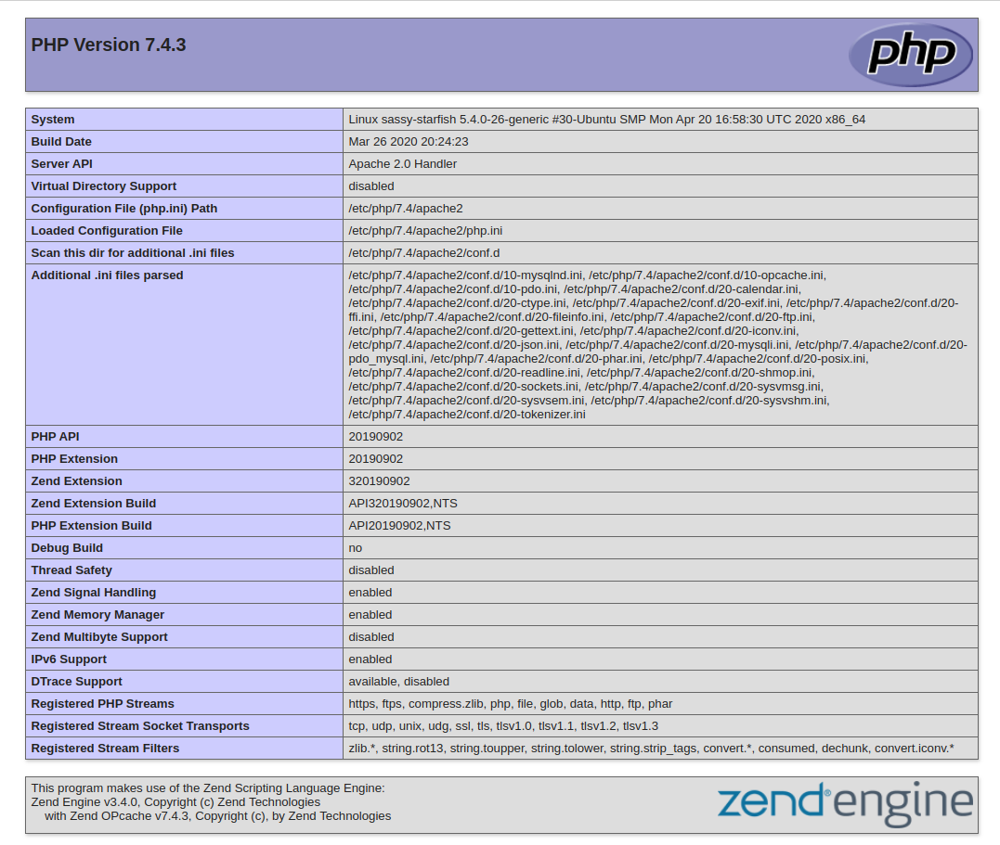

## Introduction

A LAMP stack is a group of four open-source software that form the foundation of building and running high performance web servers to host dynamic websites and web applications. This term is an acronym for Linux (the operating system ), Apache (the web server), MySQL (the database), PHP/Perl/Python (the programming language). Some popular LAMP applications are Wiki's, the majority of modern Content Management Systems (CMS such as WordPress, Joomla, Drupal, and Magento require a LAMP stack to work).

To build and run a website with PHP or you use some framework of PHP such as Codeigniter or Laravel you need a LAMP stack for your web server to store data and deliver web content through the internet.

Therefore, in this guide, I will show you how to set up a LAMP stack on an Ubuntu 20.04 server for building and running the PHP applications.

## Prerequisites

- An Ubuntu 20.04 server
- A non-root sudo user

## 1. Set up a Firewall with UFW on your server

Start by updating and upgrading packages on your Ubuntu server. If this is the first time you're using `sudo` within this session of Terminal, you'll be prompted to provide your user's password to confirm you have the right privileges. Open your Terminal then enter two line commands below in order:

```shell
sudo apt update
sudo apt upgrade
```
**Note:** the first time you run the command `sudo apt upgrade` that it will ask: *"Do you want to continue? [Y/n]"* - press **y** then **Enter** to continue.

Checking the UFW status. Normally, the default is inactive:

```shell
sudo ufw status
```

Let's set the UFW to the default, deny all incoming and allow all outgoing connections:

```shell
sudo ufw default deny incoming
sudo ufw default allow outgoing
```

Lists the UFW apps

```shell
sudo ufw app list
```

Allowing SSH connections, you need take this action to connect to the server via SSH later:

```shell
sudo ufw allow OpenSSH
```

Checking the UFW status again, it still inactive:

```shell
sudo ufw status
```

Enabling UFW, with this command will appear a question that says: *"Command may disrupt existing ssh connections. Proceed with operation (y|n)?"* - press **y** then **Enter** to agree:
```shell
sudo ufw enable
```

Checking the UFW status again, now it is active and you can see ssh is allowed:
```shell
sudo ufw status
```

## 2. Install Apache Web Server

Apache is the most commonly used Web Server in the world. It is often used in combination with the MySQL database, the PHP scripting language, and other scripting languages such as Python or Perl. This configuration is termed LAMP (Linux, Apache, MySQL and Perl/Python/PHP) and forms a powerful and robust platform for development and deployment of the web applications. That is why it is the best choice for you.

The Apache Web Server is available in Ubuntu Linux, so to install use the following command:

```shell
sudo apt install apache2
```

You'll also be prompted to confirm Apache's installation: *"Do you want to continue? [Y/n]"* - press **y**, then **Enter** to agree.

Once the installation is finished, let's list all currently available UFW apps,  you can run the command below:

```shell
sudo ufw app list
```

You'll see the output like this:

```shell
Available applications:
  Apache
  Apache Full
  Apache Secure
  OpenSSH
```

With the outputs above, what does it mean?

- **Apache:** This opens only port 80 - which is what unencrypted web servers use.
- **Apache Full:** Thisopens both ports 80 and 443. Port 80 (which is what unencrypted web servers use.), 443 (which is what encrypted web servers use)
- **Apache Secure:** This opens only port 443 (TLS/SSL encrypted traffic) - which is what encrypted web servers use.

For now, it's best to adjust the firewall to allow connections to your web server on port 80 (unencrypted web traffic), because you just installed a fresh Apache web server and you still don't have a TLS/SSL certificate configured to allow HTTPS traffic (encrypted web traffic) on your Apache server. To allow connections on port 80, use the command below:

```shell
Available applications:
sudo ufw allow "Apache"
```

You can check the UFW status to verify this change:

```shell
sudo ufw status
```

You can see the output like below:

```shell
Status: active

To               Action        From
--              -------        ----
OpenSSH          ALLOW         Anywhere
Apache           ALLOW         Anywhere
OpenSSH (v6)     ALLOW         Anywhere (v6)
Apache (v6)      ALLOW         Anywhere (v6)
```

To check whether you have installed Apache web server successfully, now visit **your server's public IP address** in your web browser. Replace the IP address below ( **192.0.2.1** ) by **your own server's public IP**:
```
http://192.0.2.1
```

You should see the default Apache web page as shown below:


**The root directory** of **the default Apache virtual host** is at **/var/www/html** and it has an **index.html** file. This file contains the information of the default Apache web page and you just saw this page above. You can check by go into **/var/www/html** directory by the `cd` command then list all files in this directory by the `ls` command and you should see an **index.html** file is listed:

```shell
cd /var/www/html
ls
```

Now, you should see the **index.html** file is listed on the output:

```shell
index.html
```

**The default virtual host's configuration file** is located in **/etc/apache2/sites-available** directory and its name is **000-default.conf**. You can see this configuration file by going into **/etc/apache2/sites-available** directory by the `cd` command then list all files in this directory by the `ls` command and you should see a file that its name is **000-default.conf** :

```shell
cd /etc/apache2/sites-available
ls
```

You should see the **000-default.conf** file is listed on the output:

```shell
000-default.conf  default-ssl.conf 
```

Open the **000-default.conf** file by the `cat` command:

```shell
cat 000-default.conf 
```

After run the command above, it will show the content of the **000-default.conf** file for you, and you can find to see line of the `DocumentRoot` directive as bellow:

```shell
<VirtualHost *:80>

        ServerAdmin webmaster@localhost
        DocumentRoot /var/www/html

</VirtualHost>
```

**Note:** the **000-default.conf** file is a configuration file of **the default Apache virtual host**. And you pay attention to the `DocumentRoot` directive above, this directive specifies **/var/www/html** directory is **the root directory** of **the default Apache virtual host**. And we just have covered above that the **/var/www/html** directory has an **index.html** file by default. The **/var/www/html** directory is **the root directory** of **the default Apache virtual host** that holds the assets of the site such as PHP script, HTML, CSS and Javascript files, images.

Now we have installed Apache web server and covered **the root directory** and **the configuration file** of **the default Apache virtual host**. Next step, we will install the MySQL database system on the server to store the data for your site.

## 3. Install MySQL

MySQL is a popular database management system that is used combined with PHP on server side to handle and store datas from the users for your site.

To install MySQL, run the following command:

```shell
sudo apt install mysql-server
```

When you are prompted to confirm the installation: *"Do you want to continue? [Y/n]"* - press **y** then **Enter** to agree.

When the installation is done, I recommend you take an extra step to ensure security for your server. Now run the command below to start the script that will re-setup some insecure options of the default configuration on your MySQL.

```shell
sudo mysql_secure_installation
```

By running the command above, it will walk you through some extra steps to change some of your MySQL installation's security options. The first will ask whether you'd like to set up **the VALIDATE PASSWORD component**. This component will help you check a password that satisfies the specified criteria.

Press **y** to set up the VALIDATE PASSWORD component:

```shell
VALIDATE PASSWORD COMPONENT can be used to test passwords
and improve security. It checks the strength of password
and allows the users to set only those passwords which are
secure enough. Would you like to setup VALIDATE PASSWORD component?

Press y|Y for Yes, any other key for No: y
```

Now, it will show you 3 levels of password validation: **LOW**, **MEDIUM** and **STRONG**. You can choose one of 3 levels by pressing **0** for **LOW**, **1** for **MEDIUM** and **2** for **STRONG**. Keep in mind that if you enter **2** for the strongest level, you will receive errors when attempting to set any password which does not contain numbers, upper and lowercase letters, and special characters, or which is based on common dictionary words. To simple, I choose **0** for **LOW** level:

```shell
There are three levels of password validation policy:
LOW    Length >= 8
MEDIUM Length >= 8, numeric, mixed case, and special characters
STRONG Length >= 8, numeric, mixed case, special characters and dictionary file
Please enter 0 = LOW, 1 = MEDIUM and 2 = STRONG: 0
```

Next, it will ask you to set a password for **MySQL root user** (don't confuse it with **the system root user**). When you enter the password which is invisible for you, then re-enter the password again and Enter to continue.

```shell
Please set the password for root here.

New password:

Re-enter new password:
```

Because we have set up **the VALIDATE PASSWORD component**, it will estimate the strength of the password you just entered. And ask whether you wish to continue with that password. If you are satisfied with it

```shell
Estimated strength of the password: 25 
Do you wish to continue with the password provided?(Press y|Y for Yes, any other key for No) :
```

==Conflicting...==

## 4. Install PHP

We have installed Apache to serve your site's assets such as store folders, files, images and site's configuration files. MySQL to store, handle and manage your site's data. Now, we will install PHP and PHP codes will be used combined with Apache and MySQL to handle the datas then display the dynamic content to the visitor.

In addition, to PHP can work together with Apache and MySQL you need the Apache PHP module is `libapache2-mod-php` to enable Apache to handle PHP files, and the `php-mysql` package to allow PHP to communicate with MySQL databases.

To install PHP and those above, run the following command:

```shell
sudo apt install php libapache2-mod-php php-mysql
```
It will ask whether you want to continue the process installation: *"Do you want to continue? [Y/n]"* - press **y** then **Enter** to agree to install.

Once the installation is finished , you can confirm the version of PHP by the following command:

```shell
php -v
```

The output look like this:

```shell
PHP 7.4.3 (cli) (built: Jun 13 2022 13:43:30) ( NTS )
Copyright (c) The PHP Group
Zend Engine v3.4.0, Copyright (c) Zend Technologies
    with Zend OPcache v7.4.3, Copyright (c), by Zend Technologies
```

At this point, you have fully installed LAMP stack: Apache2 Web Server, MySQL database management system, and PHP scripting language. It's time to set up a new Apache Virtual Host to serve your new site. Let's go to the next step.

## 5. Create an Apache Virtual Host for Your Site.

As we have covered in step 2 that Apache has **a default virtual host** with its own **configuration file** and **root directory**. But, instead of using and modifying the default Apache virtual host you should create a new virtual host with its own configuration file and root directory. And you can freely create additional virtual hosts for multiple websites on the same server, **a virtual host serves for a website (serves for a domain)**.

To create **a virtual host** you need to create **a configuration file** for it in the **/etc/apache2/sites-available** directory, the same location of **the default virtual host's configuration file** is **000-default.conf** file. Then you specify the `DocumentRoot` directive inside **the configuration file** to **the root directory** of the virtual host. **The root directory** is the directory you need to create for **the virtual host** to hold assets of the site such as PHP script, HTML, CSS and Javascript files, images. And you must create **the root directory** in the **/var/www** directory, the same location of **the default virtual host's root directory** is **/var/www/html**

First, create **a configuration file** in Apache's **sites-available** directory. Assuming we have a domain is **your_domain.com** - replace with your own domain, we will name **the configuration file** is **your_domain.conf** - replace **your_domain** based on your domain. Here I use the command-line editor is `nano` to generate and edit **the configuration file**:

```shell
sudo nano /etc/apache2/sites-available/your_domain.conf
```

The command above will create a new blank file, now copy and paste into it the following configuration code block - **Note:** replace **your_domain.com** in the line `ServerName your_domain.com` bellow by your own domain:

```shell
<VirtualHost *:80>
    ServerName your_domain.com
    ServerAdmin webmaster@localhost
    DocumentRoot /var/www/your_domain
    ErrorLog ${APACHE_LOG_DIR}/error.log
    CustomLog ${APACHE_LOG_DIR}/access.log combined
</VirtualHost>
```

Save and close the file when you're done. Because we have used `nano`, press **Ctrl+X**, then press **y** and **Enter**.

> **Important:** If you use your own domain name, you must set up the DNS on your domain name registrar to point your domain to your server's public IP address. You can search this way on Google.

You can see the `DocumentRoot` directive of **the configuration file** just created is specified to **/var/www/your_domain** directory. Now create **your_domain** directory in the **/var/www** directory as **the root directory** of **your virtual host**, use the following command:

```shell
sudo mkdir /var/www/your_domain
```

Next, assign **ownership** to the **your_domain** directory is your current system user by using the `$USER` environment variable:

```shell
sudo chown -R $USER:$USER /var/www/your_domain
```

We have finished creating **a new virtual host** with its **own configuration file** and **web root directory**. And currently your Apache server has two virtual hosts: the default virtual host and the new virtual host you just created for **your_domain.com**

Now, you must enable the new virtual host that is just created by using `a2ensite` command:

```shell
sudo a2ensite your_domain
```

> **Important:** If you only want to test the virtual host that is just created and not using a domain name - by this way you only need use **the server's public IP address** to access your site. Now, you can remove or comment out the line of the `ServerName` directive in the configuration file, re-open the **your_domain.conf** file use `nano`:

```shell
sudo nano /etc/apache2/sites-available/your_domain.conf
```

Then remove the line of the `ServerName` directive, you can comment out by put the **#** character before this directive as bellow or remove the line of the `ServerName` directive:

```shell
<VirtualHost *:80>
    #ServerName your_domain.com
    ServerAdmin webmaster@localhost
    DocumentRoot /var/www/your_domain
    ErrorLog ${APACHE_LOG_DIR}/error.log
    CustomLog ${APACHE_LOG_DIR}/access.log combined
</VirtualHost>
```

Now, you must disable the default virtual host by using `a2dissite` command:

```shell
sudo a2dissite 000-default
```

To checking whether your configuration you made doesn't contain syntax errors, run the command below:

```shell
sudo apache2ctl configtest
```

Finally, reload Apache so these changes take effect:

```shell
sudo systemctl reload apache2
```

Your new site is now active, and you can visit **your_domain.com** or the **public IP address** of your server (in the case not using a domain name). But before you do that, you need to create an **index.php** file inside the root **/var/www/your_domain** directory:

```shell
nano /var/www/your_domain/index.php
```

The command above will create a new blank file, copy and paste the PHP codes bellow into it:

```shell
<?php
phpinfo();
```

Now, open your browser and access **your_domain.com** or **your server's public IP address**:

```
http://yoour_domian.com or http://public_ip_address
```

You'll see a page similar to this:

